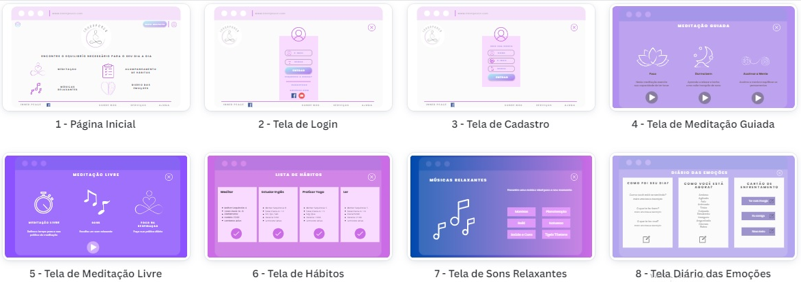

# Projeto de Interface

## User Flow

O fluxograma da figura 1, representa as páginas que os usuários irão acessar na aplicação. Foram criados os layouts da página inicial, página de login, de primeiro cadastro e de algumas funcionalidades do projeto como as meditações, músicas relaxantes, diário das emoções, lista de hábitos. Em seguida explicaremos cada uma destas telas. 

Figura 1 - Fluxo de telas dos usuários

## Protótipo

As telas estão divididas em duas categorias. A primeira categoria contém a apresentação da página inicial, login e primeiro cadastro, possui cabeçalho e rodapé trazendo a logo da marca, rede social e links de serviço e ajuda. 

No cabeçalho consta o endereço da página, ícone de login, ícone para voltar para a página inicial e botão para fazer teste grátis dos serviços. 

O corpo da página apresenta o conteúdo, traz a logo da empresa e os serviços que estão disponíveis para o usuário, meditações, músicas relaxantes, acompanhamento de hábitos e diário das emoções. 

Rodapé consta o link das redes sociais, os serviços, informações sobre a empresa e ajuda. 

A segunda categoria apresenta a tela das meditações disponíveis, diários das emoções, lista de hábitos e sons relaxantes. Nesta opção não terá o cabeçalho e rodapé, para que os usuários possam interagir apenas com a funcionalidade sem outras interferências visuais que possa interferir no momento de meditação ou o uso dos demais serviços disponíveis.  

### Protótipo de baixa fidelidade

Nesta categoria apresentaremos cada tela do sistema e suas funcionalidades.

1 - Tela Inicial

