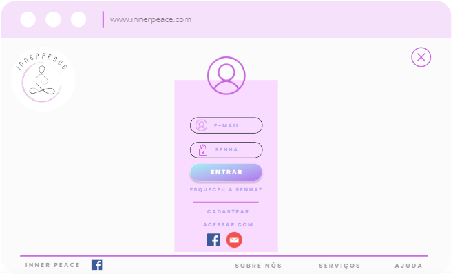
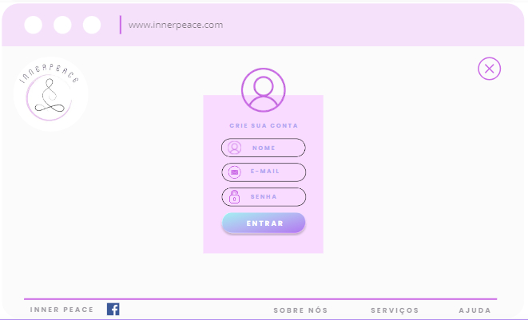
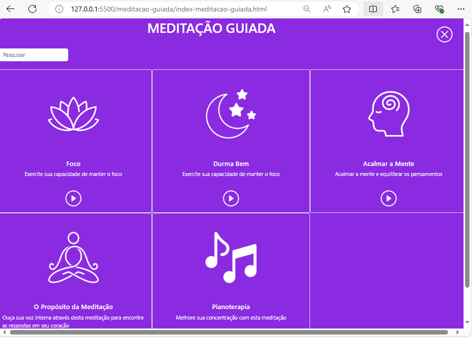
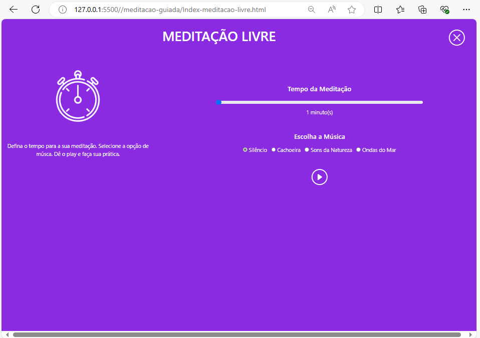
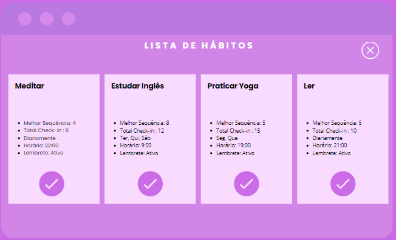
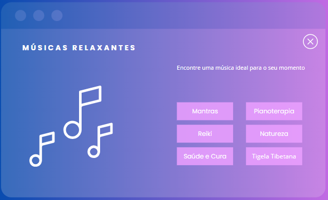

# Projeto de Interface

## User Flow

O fluxograma da figura 1, representa as páginas que os usuários irão acessar na aplicação. Foram criados os layouts da página inicial, página de login, de primeiro cadastro e das funcionalidades do projeto: meditações, músicas relaxantes, diário das emoções, lista de hábitos. Em seguida explicaremos cada uma destas telas. Para visualizar o protótipo deste projeto acesso o artefato pelo link: https://www.figma.com/design/K7EaIyz4yAw8Q3a09mcn4p/Inner-Peace?node-id=0-1 

Figura 1 - Fluxo de telas dos usuários

## Protótipo

As telas estão divididas em duas categorias. A primeira categoria contém a apresentação da página inicial, login e primeiro cadastro, possui cabeçalho, o conteúdo da página e rodapé trazendo a logo da marca, rede social e links de serviço e ajuda. 

No cabeçalho consta o endereço da página, ícone de login, ícone para voltar para a página inicial e botão para fazer teste grátis dos serviços. 
O corpo da página apresenta o conteúdo, traz a logo da empresa e os serviços que estão disponíveis para o usuário, meditações, músicas relaxantes, acompanhamento de hábitos e diário das emoções. 

Rodapé consta o link das redes sociais, os serviços, informações sobre a empresa e ajuda. 

A segunda categoria apresenta a tela das meditações disponíveis, diários das emoções, lista de hábitos e sons relaxantes. Nesta opção não terá o cabeçalho e rodapé, para que os usuários possam interagir apenas com a funcionalidade sem outras interferências visuais que possam interferir no momento de meditação ou no uso dos demais serviços disponíveis. Para retornar a página inicial basta clicar no ícone de fechar.   

### Protótipo de baixa fidelidade

Nesta categoria apresentaremos cada tela do sistema e suas funcionalidades.

**1 - Tela Página Inicial**

A tela inicial da aplicação será onde os usuários poderão interagir com o site, a página foi dividida em cabeçalho, conteúdo e rodapé. No cabeçalho consta o endereço da página, logo abaixo tem a opção de fazer o cadastro para os usuários. Ao lado do Cadastro tem a opção de logar na ferramenta. 

No corpo da página, centralizado tem a logo da marca e logo abaixo um texto e carrossel com imagens remetendo aos serviços disponibilizados na aplicação. Abaixo encontramos uma seção para estimular o desejo e interesse do usuário que está conhecendo a plataforma. Abaixo uma seção com depoimentos para prova social. Seguido de outra dedicada a falar da solução como um todo e no final pontuando melhor cada uma das soluções da aplicação. 

[documentos/img/tela_inicial.png](https://github.com/ICEI-PUC-Minas-PMV-ADS/pmv-ads-2024-1-e1-proj-web-t8-pmv-ads-2024-1-e1-projinnerpeace/blob/ea5bf299ec1c87a40ab77279d911b5b113bcb783/documentos/img/tela_inicial.png) 

Figura 2 - Tela Inicial

**2 - Tela de Login**

Clicando no ícone de Login na página inicial o usuário será levado para acessar suas credenciais com e-mail e senha, também terá a opção de recuperar a senha, cadastrar ou acessar usando o cadastro de suas redes sociais. Foi mantido a mesma estrutura da página inicial (cabeçalho, conteúdo e rodapé) e a direita possui um ícone para cancelar e voltar para a página inicial. 

Figura 3 - Tela de Login

**3 - Tela de Cadastro**

Clicando no ícone Cadastrar o usuário será direcionado para fazer seu cadastro. Deverá preencher seu nome, e-mail e criar uma senha. Após preencher os dados será direcionado para a página inicial. Foi mantido a mesma estrutura da página inicial (cabeçalho, conteúdo e rodapé) e a direita possui um ícone para cancelar e voltar para a página inicial.

Figura 4 - Tela de Cadastro

**4 - Tela de Meditação Guiada**

Esta tela apresenta uma das funcionalidades da aplicação, o layout foi alterado para apresentar apenas a seção que o usuários está, sem interferências visuais do cabeçalho e rodapé para que haja foco no momento da meditação. Esta opção ficará em tela cheia. A direita no alto da página consta o ícone com a opção de fechar e retornar para a página inicial. A esquerda consta a barra de pesquisa para busca de outras meditações. Centralizado a página consta o nome da seção e abaixo as opções de meditações disponíveis, basta o usuário clicar no ícone para dar o play e iniciar a meditação. 

Figura 5 - Tela de Meditação Guiada

**5 - Tela de Meditação Livre**

A tela de meditação livre também apresenta uma das funcionalidades da aplicação, o layout foi alterado para apresentar apenas a seção que os usuários está, sem interferências visuais do cabeçalho e rodapé para que haja foco no momento da meditação. Esta opção ficará em tela cheia. A direita no alto da página consta o ícone com a opção de fechar esta seção e retornar para a página inicial. A esquerda consta as instruções para o usuário. A direita tem uma barra de tempo para o usuário definir o tempo de meditação. Abaixo pode optar por fazer a meditação sem música, somente com a opção de um sino de alerta ao início e fim ou escolher os três sons disponíves na plataforma. Ao definir estes parametros é só o usuário clicar no botão play. Irá abrir uma caixa suspensa que irá mostrar o tempo definido e ao final do timer, a mensagem de meditação finalizada. 

Figura 6 - Tela de Meditação Livre

**6 - Tela de Hábitos**

Nesta página o layout também apresenta apenas a seção que o usuários está. Esta opção ficará em tela cheia. A direita no alto da página consta o ícone com a opção de fechar esta seção e retorna para a página inicial. Centralizado a página consta o nome da seção, nesta opção o usuário poderá criar suas listas de tarefas que deseja acompanhar seus hábitos diários. Cada quadro apresenta uma tarefa a ser monitorada, mostrando a frequência que a tarefa está sendo praticada, a quantidade de check-in, os dias que o usuário pretende realizar a tarefa, o horário e se terá notificação para lembrá-lo da atividade. A cada check-in, basta clicar no ícone de verificação da tarefa.  

Figura 7 - Tela de Hábitos

**7 - Músicas Relaxantes**

A tela de música relaxante o layout também apresenta apenas a seção que o usuários está, sem interferências visuais do cabeçalho e rodapé. Esta opção ficará em tela cheia. A direita no alto da página consta o ícone com a opção de fechar esta seção para retornar a página inicial. A direita da página consta o nome da seção e a esquerda as opções de sons que estão disponíveis para ouvir. Basta clicar no botão referente a opção desejada para que a música inicie.  

Figura 8 - Tela Músicas Relaxantes

**8 - Diário das Emoções**

Nesta página o layout também apresenta apenas a seção que o usuários está. Esta opção ficará em tela cheia. A direita no alto da página consta o ícone com a opção de fechar esta seção e retornar a página inicial. Centralizado a página consta o nome da seção e abaixo os quadros para o usuário preencher suas experiências pessoais. Na opção 'Como você está se sentindo?' o usuário deverá clicar nos ícones que representam a emoção e nos campos abaixo 'O que te fez bem?' e 'O que te fez mal?' fazer as anotações pertinentes aos acontecimentos, em seguida clica em Salvar para fazer o registro que irá aparecer a direita da página com os últimos registros. É possível editar ou excluir um registro e pesquisar por data no calendário suspenso. 

Figura 9 - Tela Diário das Emoções
